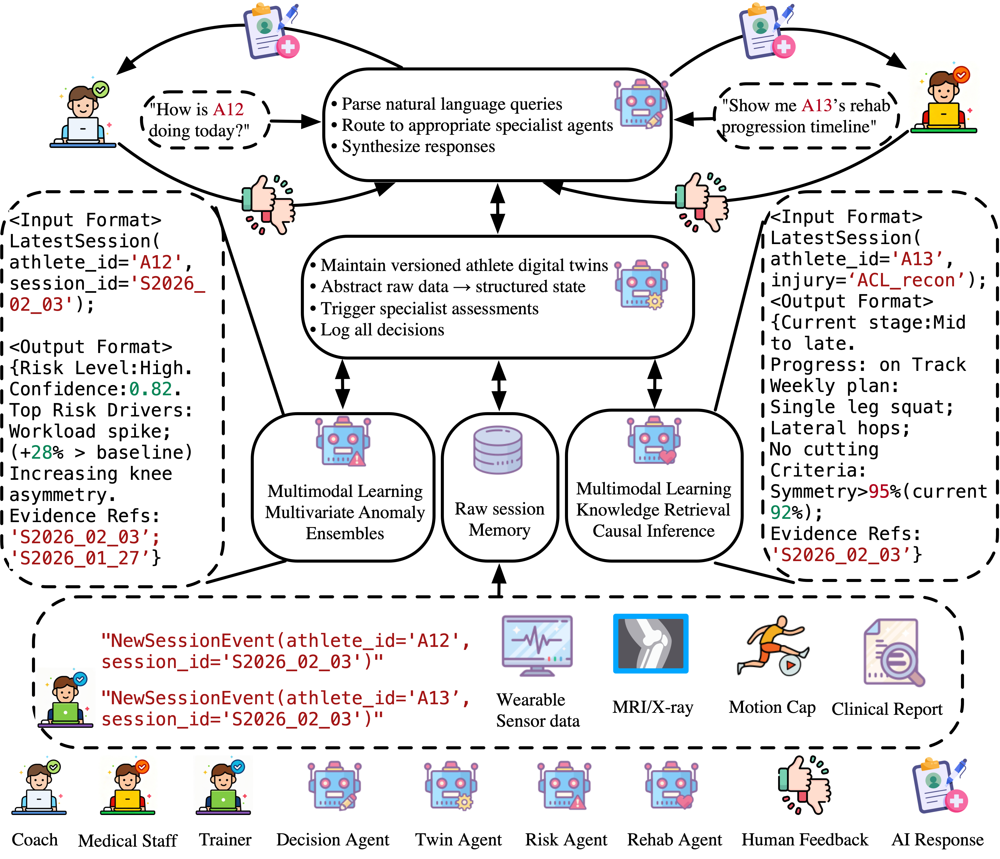

<div align="center">
  <!-- <h1><b> MASAI </b></h1> -->
  <!-- <h2><b> MASAI </b></h2> -->
  <h2><b> A Multi-Agent Digital Twin Blueprint for Athlete Injury Risk Assessment and Rehabilitation Planning </b></h2>
</div>


</div>

<p align="center">



</p>

---
>
> 🙋 Please let us know if you find out a mistake or have any suggestions!
> 
> 🌟 The repository is updating!!


## Introduction
This paper presents a Multi-Agent Digital Twin Blueprint for Athlete Injury Risk Assessment and Rehabilitation Planning. 

## Requirements

To install all dependencies:
```
pip install -r requirements.txt
```

## Datasets


## Quick Demos


## Detailed usage


## Contact
If you have any questions or suggestions, feel free to contact:
tzhao3@lsu.edu

## Acknowledgement
Our implementation adapts [Openpilot-Deepdive](https://github.com/OpenDriveLab/Openpilot-Deepdive) and [CAP_Attack](https://github.com/gitguige/openpilot0.8.9) as the code base and have extensively modified it to our purposes. We thank the authors for sharing their implementations and related resources.
